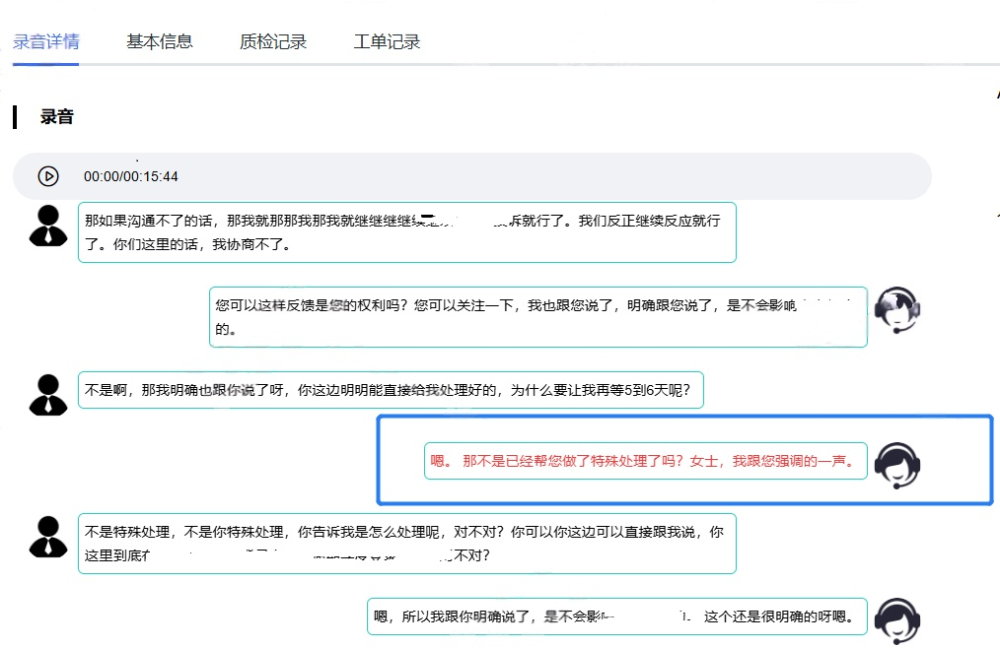

# CSQI_ASR（一种客服质检方法）

## 📢 News

+ 【2025.02.10】 V1.0版本，基于 **funasr 与 xinference**，支持语音、情感、专词、敏感词、语义相似度识别！  

## 🙌  简介

✨ **funasr实现高质量的语音转写与情感判别！** ✨

📡 **xinf集成bge实现语义相似！**  

⚡ **集成高并发，自由配置，左右声道分离，实现基础功能质检**：


## 🤖 使用方式

按照以下命令启动项目

```shell
下载模型
modelscope download --model iic/SenseVoiceSmall
修改配置
vim config.py
启动服务
python startup.py
```

### api接口

```
    hotword_url = 'http://%s:%s/audio/hotword_update' % (base_config.host, base_config.port)
    sensitive_url = 'http://%s:%s/audio/sensitive_update' % (base_config.host, base_config.port)
    sts_url = 'http://%s:%s/audio/sts_update' % (base_config.host, base_config.port)
    asr_url = 'http://%s:%s/audio/asr' % (base_config.host, base_config.port)
```


## 截图





## TODO
- 接入llm做质检项（客户意愿、座席服务质量）评分
- 自动打包为Docker镜像


## 致敬
本项目参考阿里SenseVoice、inference和pycorrector。
- [SenseVoice](https://github.com/FunAudioLLM/SenseVoice)
- [pycorrector](https://github.com/shibing624/pycorrector)
- [inference](https://github.com/xorbitsai/inference)
